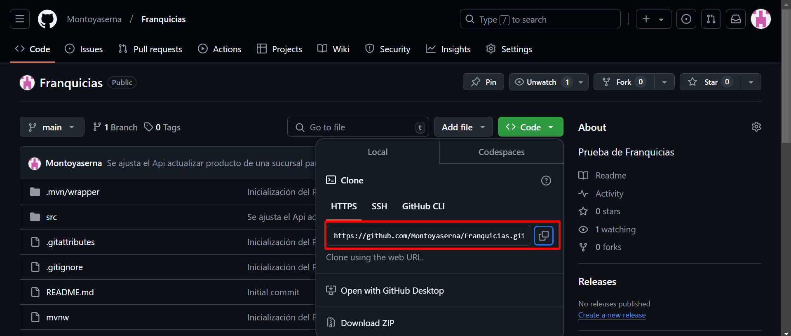
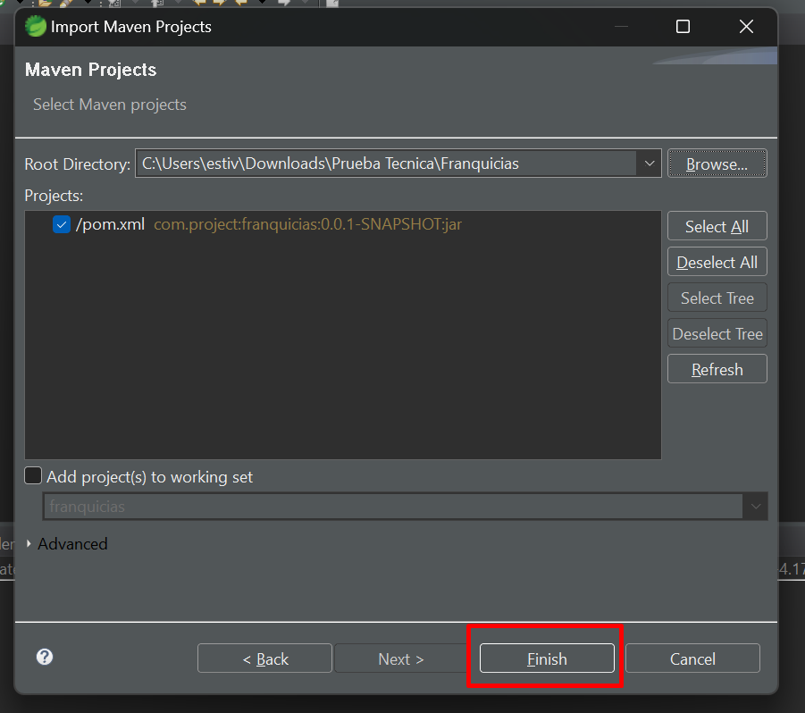
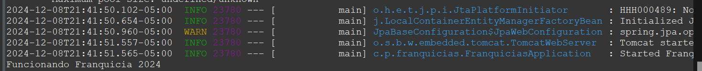
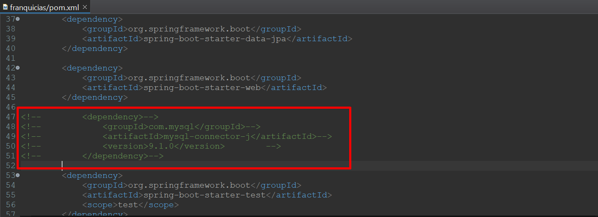
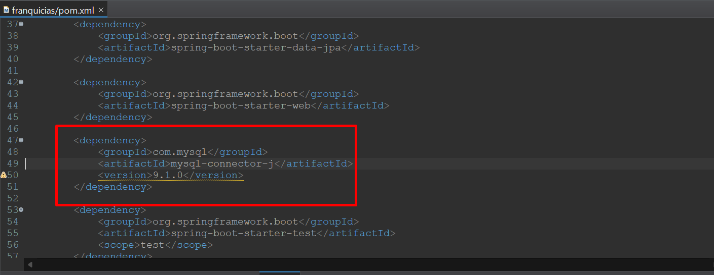

# Franquicias
Prueba de Franquicias

#Pasos para correr el proyecto en local

1. Clonar el repositorio desde github publico: https://github.com/Montoyaserna/Franquicias.git

2. Importa el proyecto en spring boot tools.

3. Ejecutar el proyecto.

Nota: Si no corre el proyecto, comentar la dependecnia mysql y volverla a activar y correr nuevamente el proyecto.

#EndPoint realizados

1. Franquicias

- Consultar Franquicias -> http://localhost:8080/v1/api/franquicias/select-all

- Crear una Franquicia -> http://localhost:8080/v1/api/franquicias/insert

{
    "nombreFranquicia" : "Claro"
}

- Actualizar una Franquicia -> http://localhost:8080/v1/api/franquicias/update

{
    "idFranquicia": 1,
    "nombreFranquicia" : "Telecon"
}

2. Sucursales

- Consultar Sucursales de una Franquicia -> http://localhost:8080/v1/api/sucursales/select-by-id-franquicia/2

- Crear una Sucursal a una Franquicia -> http://localhost:8080/v1/api/sucursales/insert

{   
    "nombreSucursal" : "Pereira",
    "idFranquicia" : 1
}

- Actualizar una Sucursal a una Franquicia -> http://localhost:8080/v1/api/sucursales/update

{   
    "idSucursal": 1,
    "nombreSucursal" : "Cartago"
}

3. Productos

- Consutar los productos de una Sucursal -> http://localhost:8080/v1/api/productos/select-by-id-sucursal/2

- http://localhost:8080/v1/api/productos/insert

{   
    "nombreProducto" : "borrador",
    "cantStock": 4,
    "idSucursal" : 2
}

- Actualizar un Producto de una Sucursal -> http://localhost:8080/v1/api/productos/update

{   
    "idProducto": 3,
    "nombreProducto" : "Pliego papel",
    "cantStock": 2
}

- Eliminar un Producto de una Sucursal -> http://localhost:8080/v1/api/productos/delete/1

